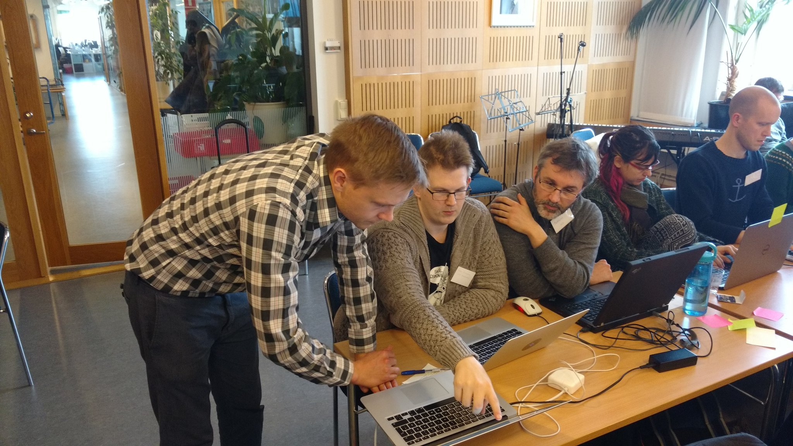

name: inverse
layout: true
class: middle

---

background-image: url(img/background.png)

---

layout: false

# CodeRefinery flash

## Many researchers .blue[create code] to create and/or analyze data

---

# Goal: better research software

### - Training: we have trained 250 students, post-docs, and researchers.
### - Infrastructure: 50 people develop code on our platform, potential: 10x.

---

# Why Nordic? Why funding us?

### - Culture and challenges very similar among countries
### - Pool resources and expertise
### - International initiative more cost-effective than running national initiatives
### - We really make a difference
### - Groups are asking us for workshops

---

class: split-40-60

# Vision

.column[
### - Reach scale
### - Instructor training
### - Give project contributors an identity
### - Connect better to research community
### - Connect better to the Carpentries
]
.column[
### [coderefinery.org](http://coderefinery.org)
### [@coderefine](https://twitter.com/coderefine)

]

---

# Team

- **Norway**: Bjørn Lindi, Radovan Bast, Sabry Razick
- **Denmark**: Damon Michael Kasacjak, Erland Hochheim
- **Sweden**: Thor Wikfeldt
- **Finland**: Erik Edelmann, Jyry Suvilehto, N. D., Risto Laurikainen, Sri Harsha Vathsavayi
