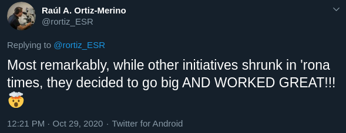

class: center, middle

# The CodeRefinery project

## Radovan Bast [@\_\_radovan](https://twitter.com/__radovan)

Nordic e-Infrastructure Collaboration/
UiT The Arctic University of Norway

## Slides (text is CC-BY): http://add-link.here

---

## CodeRefinery

We teach tools and practices for the
development of reproducible and reusable research software.

- https://coderefinery.org
- https://coderefinery.org/workshops/past/

---

.left-column30[

]
.right-column70[
### Staff and hubs

- 12 persons are on contract (~ 3 FTE), funding until Oct 2021
- Major in-kind partner: [Aalto Scientific Computing](https://scicomp.aalto.fi/)
- Major training hubs: Aalto, Stockholm, Oslo, Trondheim

### Network

- 173 persons on <https://coderefinery.zulipchat.com/>
- 552 followers on [@coderefine](https://twitter.com/coderefine)

### Workshops

- Since 2016:
  - **30 full workshops**
  - 19 other workshops/events
  - 3 instructor training events
  - **over 1400 persons trained**
- last 3 workshops: **8 volunteer instructors** (also TU Delft and NL eScience Center),
  over **60 volunteer helpers**
]

---

## Typical curriculum: 3 days or 6 half-days

- .emph[Basic and collaborative Git]: Basics, branching, merging, archaeology,
  pull requests, code review, project organization
- .emph[Social coding and open software]: Sharing, open source, licenses
- .emph[Reproducible research]: Organizing projects, sharing data, recording dependencies, environments, and steps
- .emph[Jupyter notebooks]: Deploy a reproducible notebook on [Binder](https://mybinder.org/)
- .emph[Code documentation]: Versioned documentation, Sphinx, Read the Docs, and GitHub pages
- .emph[Automated testing]: pytest and GitHub Actions
- .emph[Modular code development]: Pure functions, side effects, group discussions

---

## CodeRefinery and [Carpentries](https://carpentries.org/)

- Carpentries "teach foundational coding and data science skills to researchers worldwide"
- No competition but .emph[collaboration]
- We use an .emph[interactive style of teaching], like Carpentries
- Most of CodeRefinery lesson material uses the same "look"
- Target audience are **students and researchers who already write code**
- Intermediate level
- Problem: many students and researchers do not regard themselves as "developers"
- NeIC is Carpentries platinum .emph[member organization]
- All CodeRefinery instructors take .emph[Carpentries instructor training] and are encouraged
  to teach Carpentries workshops
- CodeRefinery project co-funds a .emph[Carpentries coordinator position] Nordics/Baltics

---

## A vision of reaching many people at once

--

---

## Scaling up during 2020: effective team work

- Lectures & code-along exercises in the main room: .emph[stream and also record]
- Get help and group exercises in a breakout room
- 100 participants, 20+ helpers
- Participants can register as teams ("bring your own breakout room")
- Installation sessions and helper preparation sessions
- [Operation manuals](https://coderefinery.github.io/manuals/)
- Asynchronous Q&A via [HackMD](https://hackmd.io/) ->
  we publish these ([example](https://coderefinery.github.io/2020-10-20-online/#questions-answers-and-feedback))

### More details

- Blog post: https://coderefinery.org/blog/2020/07/31/mega-coderefinery/
- [Presentation at CarpentryCon@Home 2020](https://github.com/coderefinery/carpentrycon-2020)

---

## Future and challenges

- We are a Nordic project but this is not a Nordic-only problem
- .emph[Funding]
- Better credit for volunteers and in-kind contributions
- Possibly establish a non-profit organization
- Governance model
- Welcoming atmosphere and diversity

---

## How to get involved

- Progression: workshop participant -> .emph[helper/ exercise leader] -> instructor training -> instructor -> lesson contributor
- https://coderefinery.org
- Community chat open to all: https://coderefinery.zulipchat.com
- Lesson sources: https://github.com/coderefinery
- Twitter: [@coderefine](https://twitter.com/coderefine)
- Newsletter: https://coderefinery.org/outreach/#the-coderefinery-newsletter

### Let us collaborate!

- Lesson reuse, remixing, contributions, and suggestions most welcome
- .emph[Collaboration on lessons and workshops] most welcome

### These slides (text is CC-BY): http://add-link.here
