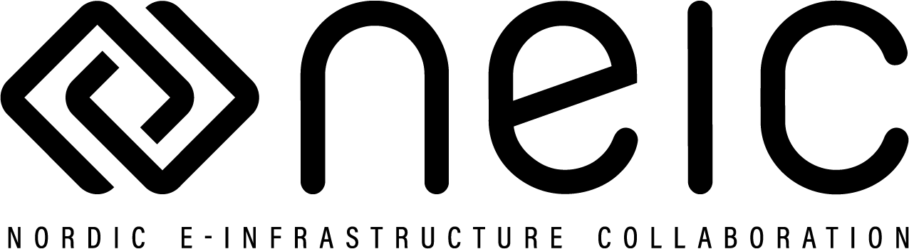

class: center, middle

# The CodeRefinery project

## Radovan Bast [@\_\_radovan](https://twitter.com/__radovan)

Nordic e-Infrastructure Collaboration/
UiT The Arctic University of Norway

## Slides (text is CC-BY): http://add-link.here

---

## About me

- Theoretical chemist turned research software engineer.
- I write research software and teach programming to researchers and lead the
  [CodeRefinery project](https://coderefinery.org).

.left-column[
### Projects

- DIRAC
- Dalton
- OpenRSP
- XCint
- XCFun
- Numgrid
- GIMIC
- Parselglossy
- Autocmake
- Runtest
- Sonar
- Smeshing
]

.right-column[
### Credits/inspiration

- Roberto Di Remigio
- Jonas Juselius
- Richard Darst
- Thor Wikfeldt
- CodeRefinery team
]

---

## CodeRefinery

We teach tools and practices for the
development of reproducible and reusable research software.

- https://coderefinery.org
- https://coderefinery.org/workshops/

---

## Plan

- Why this project
- History and funding
- Team
- CodeRefinery and Carpentries
- Workshops
- Lesson material
- Lessons learned
- Instructor training and hackathon
- Nordic RSE conference
- Nordic HPC
- Future
- How to get involved

---

## Why?

.left-column[

]
.right-column[
### Software is transforming research

- Quality of scientific software is **critical to modern research**
- **Reproducibility** of many computations is questionable
- Scientists often **lack the necessary training** in practices to
  enable them to collaboratively write high-quality scientific software
]

---

## History and funding

- **2014**: developed 1-week course "Scientific software development toolbox" at KTH within Swedish e-Science Education
- **2015**: Proposal submitted to .emph[Nordic e-Infrastructure Collaboration (NeIC)] for a Nordic-wide program, accepted
- **2016**: updated 1-week course "Scientific software development toolbox"
- **Sep. 2016**: CodeRefinery project starts with 2.5 FTE budget (Norway, Sweden, Denmark, Finland)
- **Dec. 2016**: first workshop, reduced from 5 to 3 days and adopted Carpentries teaching style
- **2018**: Phase 2 of CodeRefinery project approved for funding by NeIC, with a 3.5 FTE budget (Norway, Sweden, Denmark, Finland, Estonia)
- .emph[Phase 2 will conclude **Sep. 2021**]

### Plan for after Sep. 2021

- Involve institutions as partners (example: Aalto University)
- In-kind contributions from partners
- Coordination using a smaller budget

---

.left-column[

]
.right-column[
### Staff

- **Norway**: Anne Fouilloux, Bjørn Lindi, Radovan Bast, Sabry Razick
- **Denmark**: Max R. Eckardt, Emiliano Molinaro
- **Sweden**: Thor Wikfeldt
- **Finland**: Juho Lehtonen, Stefan Negru, João M. da Silva

### Partners

- **Aalto Science IT**: Richard Darst

### Alumni

Lukasz Bartosz Berger,
N. Denissov,
Erik Edelmann,
Erland Hochheim,
Damon Michael Kasacjak,
Pinja Koskinen,
Risto Laurikainen,
Jyry Suvilehto,
Sri Harsha Vathsavayi
]

---

## CodeRefinery and Carpentries

- No competition but collaboration
- We use the .emph[Carpentries style of teaching]
- Most of CodeRefinery lesson material uses the same "look"
- Target audience are students and researchers who already code
- Intermediate level
- Problem: many students and researchers do not regard themselves as "developers"
- NeIC is Carpentries platinum .emph[member organization]
- All CodeRefinery instructors take .emph[Carpentries instructor training] and are encouraged
  to teach Carpentries workshops
- CodeRefinery project will co-fund .emph[Carpentries coordinator position] Nordics/Baltics

---

## Workshops

- We have delivered .emph[27 workshops]
- We have trained .emph[over 600 students and researchers]
- Across all academic disciplines
- Funding for 2 more years

### Our goal

Advance .emph[FAIRness] of software management and development practices so that research groups can
.emph[collaboratively develop], review, discuss, test, share, and reuse their codes.

### Repository hosting

Code repository hosting for Nordic research software: https://coderefinery.org/repository/

---

## Workshop preparation

- More and more requested workshops
- Local organizer and a good room are very important
- List of practical requirements: https://coderefinery.org/workshop-requirements/
- Participants fill out pre-workshop survey at the time of registration
- Post-workshop survey sent out 3-6 months after workshop
- Recruiting local helpers
- Instructors and local helpers meet over video before the workshop and discuss
  [our manuals](https://github.com/coderefinery/manuals) and the workshop schedule

---

## [Lesson material](https://coderefinery.org/lessons/) (1/3)

### Basic and collaborative Git

- Basics, branching, merging, archaeology, using Guacamole recipe
- Pull requests, code review, project organization

### Git branch design

- Merge vs. rebase
- How to organize branches and avoid conflicts

### Code documentation

- Versioned documentation, Sphinx, Read the Docs, and GitHub pages

### Automated testing

- pytest and Travis CI

---

## [Lesson material](https://coderefinery.org/lessons/) (2/3)

### Jupyter notebooks

- Example with equations and plots, widgets, exercises
- Working on a mybinder example

### Integrated development environments

- Comparison of various editors and environments

### Building portable code with CMake

- CMake-ify an example project

---

## [Lesson material](https://coderefinery.org/lessons/) (3/3)

### Social coding and open software

- Sharing, open source, licenses
- Plan is to turn this into group discussions

### Modular code development

- Pure functions, side effects, group discussions

### Reproducible research

- Organizing projects, sharing data, recording dependencies, environments, and steps

---

## Lesson design and maintenance

- Backwards lesson design process
- Iterative improvements
- Changes are submitted as pull requests
- Non-trivial suggestions are submitted as issues (proposals) and discussed
- We would like to make it easier to experiment with new ideas and try them in workshops
- Coming up with good examples is a challenge
- So far no official lesson owners/maintainers yet

---

## CodeRefinery: what is our impact? (1/2)

.footnote[https://coderefinery.org]

---

## CodeRefinery: what is our impact? (2/2)

.footnote[https://coderefinery.org]

---

## Lessons learned

### Demand

- .emph[Demand for training] is huge.
- [The Carpentries](https://carpentries.org) offer great courses in basics but there is .emph[need for more advanced courses].
- More advanced courses need to become more diverse to be able to mix and match and offer different kinds of workshops.

### Collaborative version control

- Around a third of workshop participants are new to .emph[version control].
- Very few participants use .emph[code review] and .emph[automated testing] before arriving at our workshop.

### FAIR

- .emph[Software licensing and copyright] aspects are new to most participants.
- Code publishing and .emph[code citation principles] are new to most participants.
- .emph[FAIR principles] in software management are far from standard.

---

## Instructor training and hackathon

### Instructor training workshop, Stockholm, Nov. 4-5

- https://coderefinery.org/events/2019-11-04-stockholm/
- Teaching style
- Lesson design
- Lesson development process
- Lesson discussion

### Hackathon, Stockholm, Nov. 6-7

- https://coderefinery.org/events/2019-11-06-stockholm/
- Bring your own code or data
- ReproHack
- Share your expertise with others
- Networking

---

## Nordic RSE conference

- 2 day event some time in spring/summer 2020
- We will fix dates soon
- Bring together research software engineers from Nordics and beyond
- Informal presentation sessions and tutorials
- Lot of room for discussions and networking
- Learning from events in UK, Netherlands, Germany, US, and others

---

## Nordic HPC

- https://nordichpc.github.io
- We are a loose collaboration of computing facility staff and friends.
- Special focus on .emph[usability and reimagining HPC] for the modern age.
- Goal: Share solutions and problems across centers and across countries.
- Workshop in Helsinki, Nov. 14-15: https://nordichpc.github.io/2019-11-14-helsinki/

---

## Future

- Workshops!

### Room for improvement

- Less Python-centric, better cater to R and other communities
- Better cater to humanities and social sciences
- Bring in a bit more data aspect
- Specialized events/workshops for the more specialized lessons

### Sustainability

- Recruit helpers and instructors
- Instructor training
- More exposure for the material
- Establish partnerships with institutions
- Go beyond Nordics

---

## How to get involved

- https://coderefinery.org
- Community chat open to all: https://coderefinery.zulipchat.com
- Lesson sources: https://github.com/coderefinery
- Twitter: [@coderefine](https://twitter.com/coderefine)
- Newsletter: https://coderefinery.org/outreach/#the-coderefinery-newsletter
- [Instructor training](https://coderefinery.org/events/2019-11-04-stockholm/) and [hackathon](https://coderefinery.org/events/2019-11-06-stockholm/)
- Support requests: [support@coderefinery.org](mailto:support@coderefinery.org)

### Let us collaborate!

- Lesson reuse, remixing, contributions, and suggestions .emph[most welcome]
- Collaboration on lessons and workshops most welcome

### These slides (text is CC-BY): http://add-link.here
