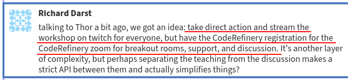
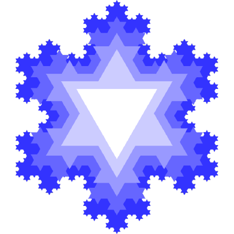

class: center, middle

# The CodeRefinery project

## Radovan Bast [@\_\_radovan](https://twitter.com/__radovan)

Nordic e-Infrastructure Collaboration/
UiT The Arctic University of Norway

## Slides (text is CC-BY): http://add-link.here

---

class: center, middle, inverse

# Teaching research software development and connecting Nordic research software engineers

---

.left-column50[
## About me

- Theoretical chemist turned research software engineer.
- I write research software and teach programming to researchers and lead the
  [CodeRefinery project](https://coderefinery.org).
- Co-author of the CMake Cookbook.
]

.right-column50[
### Code projects

- DIRAC
- Dalton
- OpenRSP
- XCint
- XCFun
- Numgrid
- GIMIC
- Parselglossy
- Autocmake
- Runtest
- Sonar
- Smeshing
- Blob
- SMARTool
]

---

## CodeRefinery

We teach tools and practices for the
development of reproducible and reusable research software.

- https://coderefinery.org
- https://coderefinery.org/workshops/past/

---

## Plan

- Why this project
- History and funding
- Team and community
- Our curriculum
- CodeRefinery and Carpentries
- Moving online and scaling up
- Instructor training
- Nordic research software engineers
- The value of the network
- Research Software Hour
- Future and challenges
- How to get involved

---

## Why?

.left-column50[

.cite[citation/source for this image needed]
]
.right-column50[
### Software is transforming research

- Quality of scientific software is **critical to modern research**
- **Reproducibility** of many computations is questionable
- Scientists often **lack the necessary training** in practices to
  enable them to collaboratively write high-quality scientific software
]

---

## History and funding

- **2014**: developed 1-week course "Scientific software development toolbox" at KTH within Swedish e-Science Education
- **2015**: Proposal submitted to .emph[Nordic e-Infrastructure Collaboration (NeIC)] for a Nordic-wide program, accepted
- **2016**: updated 1-week course "Scientific software development toolbox"
- **Sep. 2016**: CodeRefinery project starts with 2.5 FTE budget (Norway, Sweden, Denmark, Finland)
- **Dec. 2016**: first workshop, reduced from 5 to 3 days and adopted Carpentries teaching style
- **2018**: Phase 2 of CodeRefinery project approved for funding by NeIC, with a 3.5 FTE budget (Norway, Sweden, Denmark, Finland, Estonia)
- .emph[Phase 2 will conclude **Sep. 2021**]

### Plan for after Sep. 2021

- Involve institutions as partners (example: Aalto University)
- In-kind contributions from partners
- Coordination using a smaller budget

---

## Team and community

.left-column30[

]
.right-column70[
### Staff and hubs

- 12 persons are on contract (~ 3 FTE)
- Major in-kind partner: [Aalto Scientific Computing](https://scicomp.aalto.fi/)
- Major training hubs: Aalto, Stockholm, Oslo, Trondheim

### Network

- 173 persons on <https://coderefinery.zulipchat.com/>
- 552 followers on [@coderefine](https://twitter.com/coderefine)

### Last 3 workshops

- 8 volunteer instructors
- over 60 volunteer helpers
]

---

## Typical curriculum: 6 half-days

- .emph[Basic and collaborative Git]:
  Basics, branching, merging, archaeology, using Guacamole recipe
  Pull requests, code review, project organization
- .emph[Social coding and open software]: Sharing, open source, licenses
- .emph[Reproducible research]: Organizing projects, sharing data, recording dependencies, environments, and steps
- .emph[Jupyter notebooks]: Deploy a reproducible notebook on [Binder](https://mybinder.org/)
- .emph[Code documentation]: Versioned documentation, Sphinx, Read the Docs, and GitHub pages
- .emph[Automated testing]: pytest and GitHub Actions
- .emph[Modular code development]: Pure functions, side effects, group discussions

---

## CodeRefinery and [Carpentries](https://carpentries.org/)

- Carpentries "teach foundational coding and data science skills to researchers worldwide"
- No competition but .emph[collaboration]
- We use an .emph[interactive style of teaching], like Carpentries
- Most of CodeRefinery lesson material uses the same "look"
- Target audience are **students and researchers who already write code**
- Intermediate level
- Problem: many students and researchers do not regard themselves as "developers"
- NeIC is Carpentries platinum .emph[member organization]
- All CodeRefinery instructors take .emph[Carpentries instructor training] and are encouraged
  to teach Carpentries workshops
- CodeRefinery project co-funds a .emph[Carpentries coordinator position] Nordics/Baltics

---

## Lesson design and maintenance

- .emph[All lessons are CC-BY and developed in the open]
- Reverse lesson design process: .emph[start from learner personas and learning outcomes]
- Iterative improvements
- Changes are submitted as pull requests
- Non-trivial suggestions are submitted as issues (proposals) and discussed
- We would like to make it easier to experiment with new ideas and try them in workshops
- So far no official lesson owners/maintainers yet

---

## Number of workshops and persons trained over time

|                            | Phase 1 (Sep 2016 - Aug 2018) | Phase 2 (Sep 2018 - Nov 2020) |
|----------------------------|-------------------------------|-------------------------------|
| Full workshops             |   13                          |   17                          |
| Instructor training events |                               |    3                          |
| Other workshops            |    5                          |   14                          |
| Number of persons trained  |  477                          | 1073                          |

- [Number of participants by countries](https://github.com/coderefinery/workshop-data/blob/main/README.md)

---

## A vision of reaching many people at once

--

---

## Scaling up during 2020

- Lectures & code-along exercises in the main room: .emph[stream and also record]
- Get help and group exercises in a breakout room
- 100 participants, 20+ helpers
- Participants can register as teams ("bring your own breakout room")
- Installation sessions and helper preparation sessions
- [Operation manuals](https://coderefinery.github.io/manuals/)
- An .emph[effective team work!]
- Right now running the 3rd workshop at this scale

### More details

- Blog post: https://coderefinery.org/blog/2020/07/31/mega-coderefinery/
- [Presentation at CarpentryCon@Home 2020](https://github.com/coderefinery/carpentrycon-2020)

---

## CodeRefinery: what is our impact? (1/2)

.footnote[https://coderefinery.org]

---

## CodeRefinery: what is our impact? (2/2)

.footnote[https://coderefinery.org]

---

## Lessons learned

### Demand

- .emph[Demand for training] is huge.
- [The Carpentries](https://carpentries.org) offer great courses in basics but there is .emph[need for more advanced courses].
- More advanced courses need to become more diverse to be able to mix and match and offer different kinds of workshops.

### Collaborative version control

- Around a third of workshop participants are new to .emph[version control].
- Very few participants use .emph[code review] and .emph[automated testing] before arriving at our workshop.

### FAIR

- .emph[Software licensing and copyright] aspects are new to most participants.
- Code publishing and .emph[code citation principles] are new to most participants.
- .emph[FAIR principles] in software management are far from standard.

---

## Instructor training and hackathon

### Instructor training workshop, Stockholm, Nov. 4-5

- https://coderefinery.org/events/2019-11-04-stockholm/
- Teaching style
- Lesson design
- Lesson development process
- Lesson discussion

### Hackathon, Stockholm, Nov. 6-7

- https://coderefinery.org/events/2019-11-06-stockholm/
- Bring your own code or data
- ReproHack
- Share your expertise with others
- Networking

---

## Nordic RSE conference

- 2 day event some time in spring/summer 2020
- We will fix dates soon
- Bring together research software engineers from Nordics and beyond
- Informal presentation sessions and tutorials
- Lot of room for discussions and networking
- Learning from events in UK, Netherlands, Germany, US, and others

---

## Nordic HPC

- https://nordichpc.github.io
- We are a loose collaboration of computing facility staff and friends.
- Special focus on .emph[usability and reimagining HPC] for the modern age.
- Goal: Share solutions and problems across centers and across countries.
- Workshop in Helsinki, Nov. 14-15: https://nordichpc.github.io/2019-11-14-helsinki/

---

## Future

- Workshops!

### Room for improvement

- Less Python-centric, better cater to R and other communities
- Better cater to humanities and social sciences
- Bring in a bit more data aspect
- Specialized events/workshops for the more specialized lessons

### Sustainability

- Recruit helpers and instructors
- Instructor training
- More exposure for the material
- Establish partnerships with institutions
- Go beyond Nordics

---

## How to get involved

- https://coderefinery.org
- Community chat open to all: https://coderefinery.zulipchat.com
- Lesson sources: https://github.com/coderefinery
- Twitter: [@coderefine](https://twitter.com/coderefine)
- Newsletter: https://coderefinery.org/outreach/#the-coderefinery-newsletter
- Support requests: [support@coderefinery.org](mailto:support@coderefinery.org)
- Progression: workshop participant -> .emph[helper/ exercise leader] -> instructor training -> instructor -> lesson contributor
- **We hope for support from institutions and our employers** to keep this project going

### Let us collaborate!

- Lesson reuse, remixing, contributions, and suggestions most welcome
- .emph[Collaboration on lessons and workshops] most welcome

### These slides (text is CC-BY): http://add-link.here
