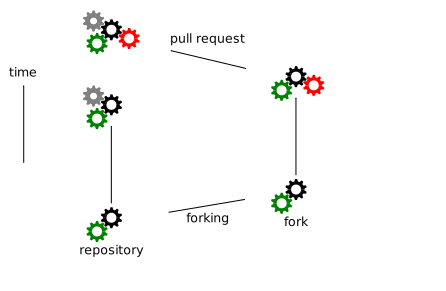

name: inverse
layout: true
class: center, middle

---

background-image: url(img/front.png)

# The CodeRefinery Project

## Radovan Bast

[coderefinery.org](http://coderefinery.org) | [@coderefine](https://twitter.com/coderefine) | [neic.nordforsk.org](https://neic.nordforsk.org)

---

layout: false
class: split-50-50


### Nordic e-Infrastructure Collaboration

- Facilitates the development and operation of high-quality e-Infrastructure solutions in areas of joint Nordic interest
- Distributed organisation consisting of technical experts from academic high-performance computing centres
- Across the Nordic countries (Denmark, Finland, Iceland, Norway, Sweden)
- Ca. 65 persons contracted by NeIC

---

## Software is transforming research

.column[

]
.column[
- Quality of scientific software is **increasingly becoming critical** for the advancement of knowledge

- Scientists often **lack the necessary training** in practices to
  enable them to collaboratively write high-quality scientific software
]

---

## Many researchers struggle with code complexity


(c) Joe Paradiso

---

class: split-60-40

## Goals: Better science with better software

.column[


(c) The New Yorker, Oct 17, 2016
]
.column[
- Provide researchers with **infrastructure**, **training**, and **guides** in the necessary tools
  and techniques to create sustainable, modular, reusable, and reproducible
  software
- Build **strong partnerships** with related initiatives
- This project is not about efficient code but rather about **efficient coding**
]

---

.left-column[


]
.right-column[
## CodeRefinery launched September 2016

- Nordic e-Infrastructure Collaboration project
- Funded for two years
- We are a team of enthusiasts located in DK, FI, NO, SE

### Team

- Bjørn Lindi
- Erik Edelmann
- Jyry Suvilehto
- Lukasz Bartosz Berger
- Nikolai Denissov
- Radovan Bast
- Sabry Razick
- Sri Harsha Vathsavayi
- Thor Wikfeldt

### Alumni

- Pinja Koskinen
]

---

## Version control: record every change


*"I don't need version control because it is just me."*

---

## Version control: make it possible to collaborate


- We plan to deploy a Nordic-wide code repository hosting platform

---

## Automated testing

```python
def get_bmi(mass_kg, height_m):
    """
    Calculates the body mass index.
    """
    return mass_kg/(height_m**2)


def test_get_bmi():
    bmi = get_bmi(mass_kg=90.0, height_m=1.91)
    expected_result = 24.670376
    assert abs(bmi - expected_result) < 1.0e-6
```

### Bonus

- Robust code
- Best documentation
- Simplify collaboration
- Guides towards modular code structure

---

class: split-60-40

.column[

]
.column[
- Suiting up to modify untested code
]

---

### Good code (pure)

```python
# function which computes the body mass index
def get_bmi(mass_kg, height_m):
    return mass_kg/(height_m**2)

# compute the body mass index
bmi = get_bmi(mass_kg=90.0, height_m=1.91))
```

### Less good code (side effects)

```python
mass_kg = 90.0
height_m = 1.91
bmi = 0.0

# function which computes the body mass index
def get_bmi():
    global bmi
    bmi = mass_kg/(height_m**2)

# compute the body mass index
get_bmi()
```

---

## Enemy of the state

.left-column[

]
.right-column[
### Strive for pure functions, fear the state

- Pure functions do not have side effects
- Side effects lead to bugs and increase complexity
- Pure functions are easier to
    - Test
    - Understand
    - Reuse
    - Parallelize
    - Simplify
    - Refactor
    - Optimize

### But we need to deal with state somewhere
]

---

## Recommendations

- Keep I/O on the outside and connected
- Always read/write on the outside and pass data
- Do not read/write deep down inside the code
- Keep the inside of your code pure/stateless
- Move all the state "up" to the caller
- Keep the stateful outside shell thin
- Unit test the inside
- Regression test the shell


---

## Continuous integration service

- [Travis CI](https://travis-ci.org)
- [Jenkins](https://jenkins.io)
- Test every changeset
- We plan to deploy a service which will make it easier for researchers to test their code


---

## Documentation

- Close to the code (minimize barrier)
- **Versions**: If the project has versions, the documentation should too
- Lightweight markup (LaTeX is not lightweight enough)
- Readable on any device
- Division into tutorials and keyword reference
- Tutorials contain good defaults
- Ready examples that one can copy-paste to get quickly started
- Prose, written by humans

### Current gold standard (in my opinion):

### [GitHub](https://github.com)/[GitLab](https://gitlab.com)/[Bitbucket](https://bitbucket.org) -> [RST](http://docutils.sourceforge.net/rst.html)/[Sphinx](http://www.sphinx-doc.org) -> [Read the Docs](https://readthedocs.org)

---

template: inverse

## How can you publish a Nature paper?

---

## How to publish a Nature paper

- Ask the Nature IT admins to give you access to their server
- Promise to submit a high quality paper
  in the right place and using the right format and style
- Once you get access simply upload your article sources
- Make sure the issue looks good
- If somebody complains later, make corrections

---


---

## Use code review

### Peer review process in publishing

- Papers are reviewed before they are published
- Maintain standards of quality
- Improve performance
- Provide credibility

### Code review

- Code is reviewed before it is integrated
- Improve quality
- Learning
- Knowledge transfer
- [GitHub](https://github.com)/[GitLab](https://gitlab.com)/[Bitbucket](https://bitbucket.org) offer a web solution for code review
- Consider code reading sessions

*"We don't need code review because we are just two."*

---

## Code review workflow



---

## Modular code development

### Modular design is good - examples:

- Lego
- Car manufacturing
- Design of your phone or laptop
- Modular composition when you order a laptop
- Success of USB
- Erasmus study program

### Advantages

- Separation of concerns
- Composability
- Leveraging functionality

---

## Code complexity/viscosity: simple vs. easy


---

## Code sharing platform

### Open-source software

- [GitHub](https://github.com)/[GitLab](https://gitlab.com)/[Bitbucket](https://bitbucket.org)
- Often anonymous download

### Closed-source software

- Typically has paid maintainers
- Own distribution websites

### Open-use software

- Typically no budget
- Often "home-cooked" solutions
- Often anonymous download not enough
- Maintenance burden

---

class: split-60-40

## Coming to a city near you

- [Typical workshop schedule](http://coderefinery.org/workshops/2017-05-09-copenhagen/)

.column[

]
.column[
- Dec 2016 - Helsinki
- Feb 2017 - Stockholm
- May 2017 - Copenhagen
- May 2017 - Umeå
- Jun 2017 - Tromsø
- Oct 2017 - Aarhus
- Nov 2017 - Linköping
- Dec 2017 - Helsinki
- Feb 2018 - Trondheim
- Mar 2018 - Turku
- Apr 2018 - Odense
- May 2018 - Uppsala
- Jun 2018 - Oslo
- Aug 2018 - Reykjavík
]

---

## Upcoming events

### 3-day workshops

- [Copenhagen, May 9-11](http://coderefinery.org/workshops/2017-05-09-copenhagen/)
- Tromsø, Jun 19-21

### [NeIC 2017 conference](http://neic2017.nordforsk.org)

- [Umeå, May 29](http://neic2017.nordforsk.org/workshops/coderefinery/): Mixed Martial Arts - Interfacing Fortran, C, C++, and Python for Great Good!

### Seminars and meetups

- [Oslo, Apr 6](http://www.uio.no/english/services/it/research/events/coderefinery-2017-april.html)
- Stockholm, May 19

---

class: split-40-60

## Get in touch!

.column[
### [coderefinery.org](http://coderefinery.org)

### [@coderefine](https://twitter.com/coderefine)

### [github.com/coderefinery](https://github.com/coderefinery)
]
.column[

]
