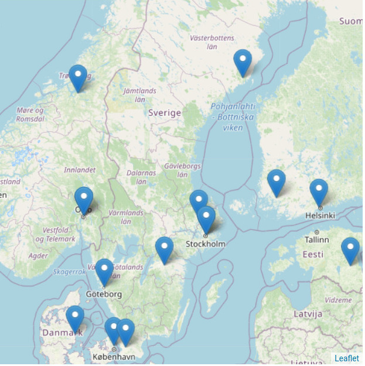
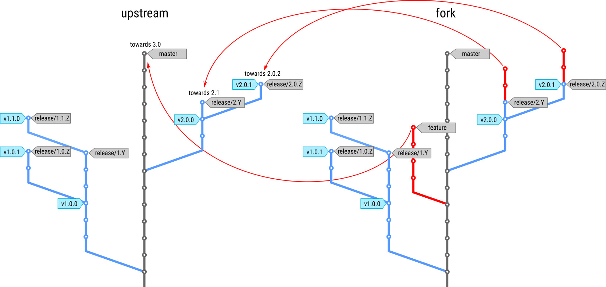

name: inverse
layout: true
class: middle

---

background-image: url(img/front.png)

# The CodeRefinery Project

## Radovan Bast

### [NeIC](https://neic.nordforsk.org)/ [UiT The Arctic University of Norway](https://uit.no)

### Slides: [http://bit.ly/coderefinery-oslo-2017](http://bit.ly/coderefinery-oslo-2017)

Text is free to share/remix under [CC BY-SA 4.0](https://creativecommons.org/licenses/by-sa/4.0/).
Code examples: [MIT license](http://opensource.org/licenses/mit-license.html).

---

layout: false
class: split-50-50


### Nordic e-Infrastructure Collaboration

- Facilitates the development and operation of high-quality e-Infrastructure solutions in areas of joint Nordic interest
- Distributed organisation consisting of technical experts from academic high-performance computing centres
- Across the Nordic countries (Denmark, Finland, Iceland, Norway, Sweden)
- Ca. 65 persons contracted by NeIC

---

## Software is transforming research

.column[

]
.column[
- Quality of scientific software is **critical to modern research**

- Scientists often **lack the necessary training** in practices to
  enable them to collaboratively write high-quality scientific software
]

---

class: split-60-40

## Goals: Better science with better software

.column[


(c) The New Yorker, Oct 17, 2016
]
.column[
- Provide researchers with **infrastructure**, **training**, and **guides** in the necessary tools
  and techniques to create sustainable, modular, reusable, and reproducible
  software
- Build **strong partnerships** with related initiatives
- This project is not about efficient code but rather about **efficient coding**
]

---

## FAQ: How do we differ?

### [Software Carpentry](https://software-carpentry.org)

- Teaching basic lab skills for research computing

### [The Software Sustainability Institute](https://www.software.ac.uk)

- Cultivate better, more sustainable, research software to enable world-class
  research (better software, better research).

### [CodeRefinery](https://www.software.ac.uk)

- Training and infrastructure for sustainable research software development
- Managing complexity in a collaborative setting

---

## Many researchers struggle with code complexity


(c) Joe Paradiso

---

.left-column[


]
.right-column[
## CodeRefinery launched September 2016

- Nordic e-Infrastructure Collaboration project
- Funded for two years
- We are a team of enthusiasts located in DK, FI, NO, SE

### Team

- Bjørn Lindi
- Erik Edelmann
- Jyry Suvilehto
- Lukasz Bartosz Berger
- Nikolai Denissov
- Radovan Bast
- Sabry Razick
- Sri Harsha Vathsavayi
- Thor Wikfeldt

### Alumni

- Pinja Koskinen
]

---

class: split-60-40

## Coming to a city near you

.column[

]
.column[
- Dec 2016 - Helsinki
- Feb 2017 - Stockholm
- May 2017 - Copenhagen
- May 2017 - Umeå
- Jun 2017 - Tromsø
- Oct 2017 - Aarhus
- Nov 2017 - Linköping
- Dec 2017 - Helsinki
- Feb 2018 - Trondheim
- Mar 2018 - Turku
- Apr 2018 - Odense
- May 2018 - Uppsala
- Jun 2018 - Oslo
- Aug 2018 - Reykjavík
]

---

## Code complexity/viscosity: simple vs. easy


---

## Version control: record snapshots as you develop


---

template: inverse

## "I don't need version control because ..."

- ... it is just me.
- ... we are only two people.
- ... I carefully test my code.
- ... we do not distribute the code.
- ... we are a research group and not a software company.
- ... I do not have time to learn it. It's publish or perish.
- ... I am interested in science and not in software engineering.

---

## Motivation for version control

### Relevant also in a single-person universe

- Undo functionality
- Working on several features in parallel
- Reproducibility
- Bug exposure can be traced back: **code history is extremely valuable**

### Working with others

- People working in parallel on the same project
- Simplify integration of external contributions

---

## Version control: make it possible to collaborate


---

## Branching model



---

## Automated testing

```python
def get_bmi(mass_kg, height_m):
    """
    Calculates the body mass index.
    """
    return mass_kg/(height_m**2)


def test_get_bmi():
    bmi = get_bmi(mass_kg=90.0, height_m=1.91)
    expected_result = 24.670376
    assert abs(bmi - expected_result) < 1.0e-6
```

### Motivation

- More robust code
- Simplify collaboration
- Documentation which is up to date by definition
- Make it easier to contribute code
- Guides towards modular code structure

---

class: split-60-40

.column[

]
.column[
### Suiting up to modify untested code
]

---

### Good code (pure: no side effects)

```python
# function which computes the body mass index
def get_bmi(mass_kg, height_m):
    return mass_kg/(height_m**2)

# compute the body mass index
bmi = get_bmi(mass_kg=90.0, height_m=1.91))
```

### Less good code (impure: side effects)

```python
mass_kg = 90.0
height_m = 1.91
bmi = 0.0

# function which computes the body mass index
def get_bmi():
    global bmi
    bmi = mass_kg/(height_m**2)

# compute the body mass index
get_bmi()
```

---

## Enemy of the state

.left-column[

]
.right-column[
### Strive for pure functions, fear the state

- Pure functions do not have side effects
- Side effects lead to bugs and increase complexity
- Pure functions are easier to
    - Test
    - Understand
    - Reuse
    - Parallelize
    - Simplify
    - Refactor
    - Optimize
]

---

## Equational reasoning

- We start with a function:
  $$ f(x) $$
- We wish to evaluate this:
  $$ y = f(a) + f(b) \times [f(c) - f(c)] $$
- We can simplify:
  $$ y = f(a) + f(b) \times 0 $$
  $$ y = f(a) $$
- Another example:
  $$ z = f(a) + f(b) + f(c) + f(d) $$
- We know we can rearrange (important for concurrency):
  $$ z = f(b) + f(d) + f(c) + f(a) $$

---

## Concurrency

- Concurrency in imperative code is very hard
- You are totally lost in the dark without a good thread checker
- In a pure, immutable world concurrency is nearly trivial!
- Prefer immutable data to mutable data


(Slide taken from [Complexity in software development by Jonas Juselius](https://github.com/scisoft/complexity))

---

## Composition

- Build complex behavior from simple components
- We can reason about the components and the composite
- Composition is key to managing complexity
- Modularity does not imply simplicity, but is enabled by it


(Slide taken from [Complexity in software development by Jonas Juselius](https://github.com/scisoft/complexity))

---

## Modular code development

### Modular design is good - examples:

- Lego
- Car manufacturing
- Design of your phone or laptop
- Modular composition when you order a laptop
- Success of USB
- Erasmus study program

### Advantages

- Separation of concerns
- Composability
- Leveraging functionality

---

## Documentation

- Close to the code (minimize barrier to contribute)
- **Versions**
- **Branches**
- Lightweight markup
- Readable on any device
- Division into tutorials and keyword reference
- Tutorials contain good defaults
- Ready examples that one can copy-paste to get quickly started

### Current gold standard

- Hosting: [GitHub](https://github.com) or [GitLab](https://gitlab.com) or [Bitbucket](https://bitbucket.org)
- Markup: [RST](http://docutils.sourceforge.net/rst.html) or [Markdown](http://daringfireball.net/projects/markdown/)
- Rendering: [Sphinx](http://www.sphinx-doc.org) or [GitBook](https://www.gitbook.com)
- Deployed to: [Read the Docs](https://readthedocs.org) or [GitBook](https://www.gitbook.com)

---

## Building portable and modular code with CMake

- Separation of source and build path
- Portability
- Language support
- Supports modular code development
- Provides tools
- Popular
- General

---

template: inverse

## How can you publish a Nature paper?

---

## How to publish a Nature paper

- Ask the Nature IT admins to give you access to their server
- Promise to submit a high quality paper
  in the right place and using the right format and style
- Once you get access simply upload your article sources
- Make sure the issue looks good
- If somebody complains later, make corrections

---


---

## Code review workflow


---

## Forking workflow


---

## Use code review

### Peer review process in publishing

- Papers are reviewed before they are published
- Maintain standards of quality
- Improve performance
- Provide credibility

### Code review

- Code is reviewed before it is integrated
- Improve quality
- Learning
- Knowledge transfer
- [GitHub](https://github.com)/[GitLab](https://gitlab.com)/[Bitbucket](https://bitbucket.org) offer a web solution for code review

*"We don't need code review because we are just two."*

---

## Suggestion: Code reading sessions

- Read and discuss code written in your group
- Read code written by others
- Read code in the standard library


### "Whenever you write, strive for originality, but if you have to steal, steal from the best."
(Woody Allen in Anything Else, 2003)

---

## Suggestions for future topics

- Contribution guides
- How to open-source a project
- Software licenses
- Mixed-language development
- Reproducible science

---

template: inverse

## Infrastructure plans

---

## Plan: Nordic-wide code repository hosting platform

- Repository hosting
- Code review
- Issue tracking
- Documentation


.cite[By Ty Wilkins - https://about.gitlab.com/2015/07/03/our-new-logo/, CC BY-SA 4.0]

---

## Plan: Continuous integration service

- [Travis CI](https://travis-ci.org), [GitLab CI](https://about.gitlab.com/gitlab-ci/), [Jenkins](https://jenkins.io), [Drone](https://github.com/drone/drone), [AppVeyor](https://www.appveyor.com), ...
- Test every changeset
- We plan to deploy a service which will make it easier for researchers to test their code


---

## Idea: Code sharing platform - discoverable and citable

### Open-source software

- [GitHub](https://github.com)/[GitLab](https://gitlab.com)/[Bitbucket](https://bitbucket.org)
- Often anonymous download

### Closed-source software

- Typically has paid maintainers
- Own distribution websites

### Open-use software

- Typically no budget
- Often "home-cooked" solutions
- Often anonymous download not enough
- Maintenance burden

---

## Upcoming events

### 3-day workshops

- [Copenhagen, May 9-11](http://coderefinery.org/workshops/2017-05-09-copenhagen/)
- [Tromsø, Jun 19-21](http://coderefinery.org/workshops/2017-06-19-tromso/)
- Many more after summer

### [NeIC 2017 conference](http://neic2017.nordforsk.org)

- [Umeå, May 29](http://neic2017.nordforsk.org/workshops/coderefinery/): Mixed Martial Arts - Interfacing Fortran, C, C++, and Python for Great Good!

### Seminars and meetups

- [Stockholm, May 19](http://coderefinery.org/workshops/2017-05-19-stockholm/)

---

class: split-50-50

## Get in touch!

### Slides: [http://bit.ly/coderefinery-oslo-2017](http://bit.ly/coderefinery-oslo-2017)

.column[
### [coderefinery.org](http://coderefinery.org)

### [@coderefine](https://twitter.com/coderefine)

### [github.com/coderefinery](https://github.com/coderefinery)

### [coderefinery@googlegroups.com](https://groups.google.com/group/coderefinery)
]
.column[

]
